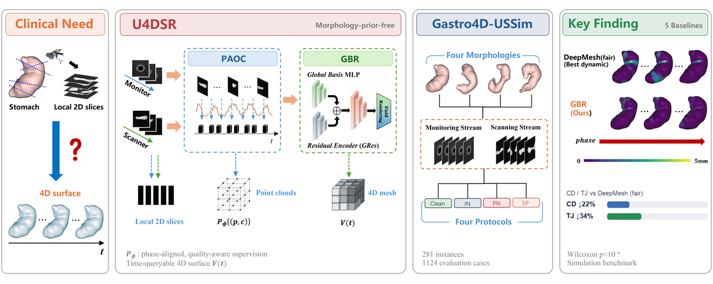
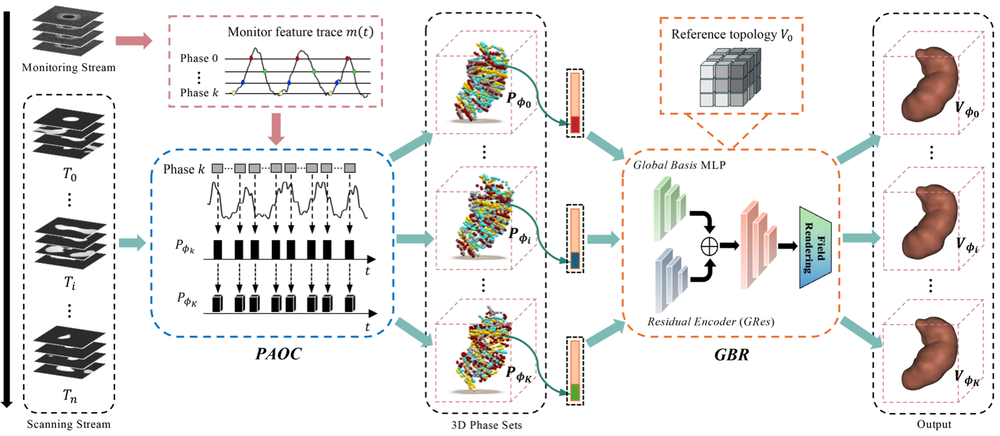
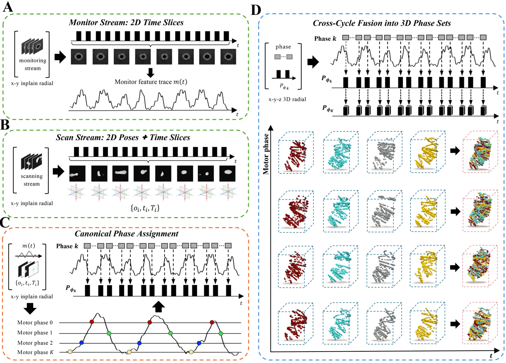
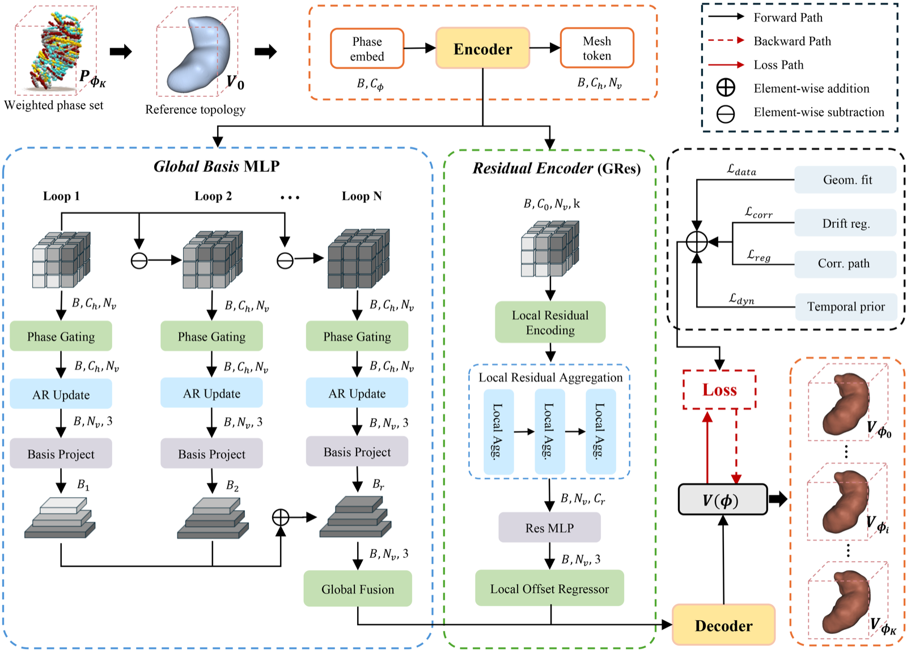
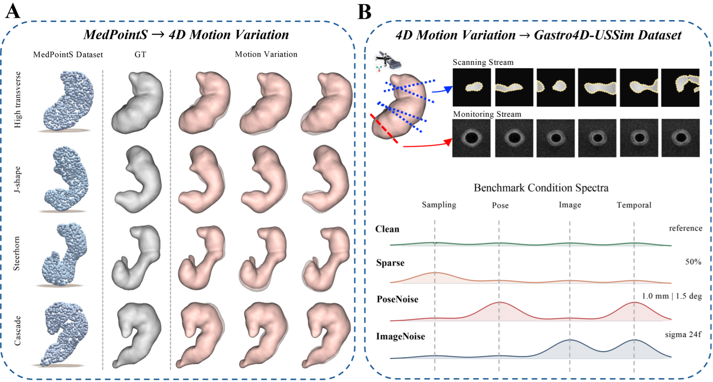

# U4DSR-Gastro4D-USSim

Code and benchmark metadata for **morphology-prior-free 4D dynamic gastric surface reconstruction from freehand ultrasound** (Medical Image Analysis, under review).

**U4DSR** couples phase-aligned observation construction (**PAOC**) with Global-Basis Residual dynamic modeling (**GBR**). **Gastro4D-USSim** provides a dual-stream simulation benchmark for gastric freehand ultrasound 4D surface reconstruction.

<p align="center">
  
</p>

## Method

<p align="center">
  
</p>

<p align="center"><em>Figure 1. U4DSR framework: monitor/scanner streams, PAOC phase-set construction, and GBR dynamic reconstruction on shared topology.</em></p>

Dynamic surface representation:

$$
V(\phi) = V_0 + \bar{\Delta} + \sum_{r=1}^{R} \alpha_r(\phi)\, B_r + R_\theta(V_0, \phi)
$$

<p align="center">
  
</p>

<p align="center"><em>Figure 2. PAOC: nonlinear phase canonicalization and confidence-weighted phase-set construction.</em></p>

<p align="center">
  
</p>

<p align="center"><em>Figure 3. GBR: global motion bases and phase-conditioned residual deformation.</em></p>

Released implementation:

- `gbr_4d_ums/phase.py`, `gbr_4d_ums/observations.py` — PAOC
- `gbr_4d_ums/model.py`, `gbr_4d_ums/pipeline.py`, `gbr_4d_ums/topology.py` — GBR

Baseline code from the paper is not included in this repository.

## Benchmark

<p align="center">
  
</p>

<p align="center"><em>Figure 4. Gastro4D-USSim benchmark construction.</em></p>

| Component | Specification | Scale |
| --- | --- | --- |
| Instances | MedPointS + 4D motion + dual-stream US | 281 |
| Morphology | HT, J, Steerhorn, Cascade | 4 |
| Protocols | Clean / Sparse / PoseNoise / ImageNoise | 4 |
| Cases | instance × protocol | 1,124 |
| Split | `dev` / `test` | 81 / 200 |

Manifest schema and summary: `benchmark/`.

## Dataset access (Gastro4D-USSim)

The full **Gastro4D-USSim** simulation archive is released under a signed data access agreement.

**To request access:**

1. Download [`docs/Gastro4D-USSim_Data_Access_Agreement.pdf`](docs/Gastro4D-USSim_Data_Access_Agreement.pdf)

2. Print the agreement, sign it, and scan it as a **single PDF** document.

3. Send the signed e-copy to **nancy_l_l@163.com** (Liu Yanan).  
   Please include your name, affiliation, intended use, and Baidu Netdisk account (if available).

4. If approved, **Baidu Pan download instructions** will be sent to you by email.

Further details: [`benchmark/DATA_ACCESS.md`](benchmark/DATA_ACCESS.md).

## Results

<p align="center">
  
</p>

<p align="center"><em>Supplementary Video 1. Cross-protocol qualitative comparison (<a href="assets/videos/supplementary_video1_cross_protocol.mp4">MP4</a>).</em></p>

On the frozen `test` split, GBR reduces geometry and temporal-jitter errors by 20–34% versus DeepMesh (fair) under clean and degraded protocols. Full tables and ablations are reported in the manuscript and supplementary material.

## Installation

```bash
python -m venv .venv
source .venv/bin/activate
pip install -e .
python scripts/run_demo.py
```

Python ≥ 3.10, NumPy, and PyTorch are required. The demo runs on synthetic data and exports `demo/outputs/demo_summary.json`.

## Citation

```bibtex
@article{liu2026u4dsr,
  title   = {Morphology-prior-free 4D dynamic gastric surface reconstruction from freehand ultrasound},
  author  = {Liu, Yanan},
  journal = {Medical Image Analysis},
  year    = {2026},
  note    = {Under review}
}
```

## License

BSD 3-Clause License. See `LICENSE`.
